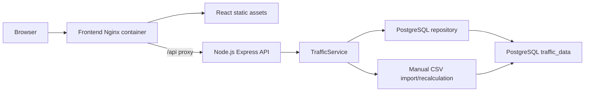

# Traffic Data Dashboard

Full-stack traffic analytics dashboard built for the take-home assignment. The app presents country-wise traffic and vehicle-type distribution through interactive Recharts visualizations, backed by a Node.js API and PostgreSQL storage.

## Assignment Coverage

- Frontend: responsive React/Vite UI with interactive country ranking, total trend, vehicle distribution, yearly stacked bars, and cumulative composition charts.
- Backend: Node.js, Express, AJV request validation, service/repository layers, and CRUD APIs for traffic records.
- Database: PostgreSQL table `traffic_data`, automatic schema creation, CSV import, calculated aggregate rows, and raw-row updates.
- Scalability: documented 5 RPS, 50 RPS, and 500 RPS path.
- Bonus: Dockerfiles, Docker Compose, GitHub Actions CI, GitHub Actions deployment to AWS ECR and a single EC2 instance using GitHub OIDC (no long-lived AWS keys).

## Project Structure

```text
TrafficData/
  backend/
    scripts/
    src/
      controllers/
      database/
      dto/
      middlewares/
      repositories/
      routes/
      schemas/
      services/
  deploy/
    ec2-deploy.sh
  frontend/
    src/
      components/
      context/
      hooks/
      lib/
      services/
      types/
  .github/workflows/
    ci.yml
    deploy-ecr-ec2.yml
  docker-compose.yml
  road_tf_veh_linear_2_0 2 _ cleaned.csv
```

## Dataset

The source dataset is `road_tf_veh_linear_2_0 2 _ cleaned.csv` in the repository root.

CSV columns used by the app:

| Column | Meaning | Example |
| --- | --- | --- |
| `vehicle_id` | Vehicle category code from the source dataset | `CAR`, `LOR`, `TOTAL` |
| `country_code` | Country code used for filtering and labels | `FR`, `DE`, `UK` |
| `year` | Reporting year | `2024` |
| `traffic_volume` | Numeric traffic volume used in all sums/charts | `7494045.604` |

Dataset shape currently loaded:

- Rows: 6,839
- Year range: 2011-2024
- Countries: AT Austria, BE Belgium, BG Bulgaria, CH Switzerland, CY Cyprus, CZ Czechia, DE Germany, DK Denmark, EE Estonia, ES Spain, FI Finland, FR France, GE Georgia, HR Croatia, HU Hungary, IE Ireland, IS Iceland, IT Italy, LT Lithuania, LV Latvia, MK North Macedonia, MT Malta, NL Netherlands, NO Norway, PL Poland, PT Portugal, RO Romania, SE Sweden, SI Slovenia, TR Turkiye, UA Ukraine, UK United Kingdom.
- Source vehicle codes: `BIKE`, `BUS`, `BUS_MCO_MIN`, `BUS_MCO_TRO`, `BUS_TRO`, `CAR`, `LOR`, `LOR_GT3P5-6`, `LOR_GT6`, `LOR_LE3P5`, `MCO`, `MOP`, `MOTO`, `MOTO_MOP`, `RDMVEH_OTH`, `TOTAL`, `TRC`.

## Calculation Rules

Raw CSV rows are stored with `is_calculated = false`. The backend also creates chart-ready calculated rows with `is_calculated = true`.

Calculated rows are stored in the same PostgreSQL table, `traffic_data`:

```sql
SELECT country_code, year, vehicle_id, traffic_volume
FROM traffic_data
WHERE is_calculated = TRUE;
```

For every `(country_code, year)` group:

- Calculated total: `TOTAL = sum(traffic_volume)` across all raw rows for that country and year.
- `CAR = CAR`
- `LOR = LOR + LOR_LE3P5 + LOR_GT3P5-6 + LOR_GT6 + TRC`
- `MOTO = MOTO + MOTO_MOP + MOP`
- `BUS = BUS + BUS_MCO_TRO + BUS_MCO_MIN + BUS_TRO + MCO`
- `BIKE = BIKE`
- `RDMVEH_OTH = RDMVEH_OTH + raw TOTAL`

Raw top-level vehicle rows are preserved as unidentified child buckets so the charts can distinguish reported parent totals from reported subcategories:

- `CAR_UNIDENTIFIED = raw CAR`
- `LOR_UNIDENTIFIED = raw LOR`
- `MOTO_UNIDENTIFIED = raw MOTO`
- `BUS_UNIDENTIFIED = raw BUS`
- `BIKE_UNIDENTIFIED = raw BIKE`
- `RDMVEH_OTH_UNIDENTIFIED = raw RDMVEH_OTH + raw TOTAL`

Important distinction: raw `vehicle_id = TOTAL` is treated as "Other unidentified vehicles" inside vehicle distribution charts, while calculated `vehicle_id = TOTAL` is the absolute country/year total.

The calculation implementation lives in `backend/src/services/trafficNormalization.js`. PostgreSQL import and recalculation logic lives in `backend/src/database/trafficDataImport.js`.

## Local Setup

Install dependencies:

```powershell
cd D:\TrafficData\backend
npm install

cd D:\TrafficData\frontend
npm install
```

Run backend from the root CSV without PostgreSQL:

```powershell
cd D:\TrafficData\backend
npm run dev:csv
```

Run backend with PostgreSQL from `backend/.env`:

```powershell
cd D:\TrafficData\backend
copy .env.example .env
npm run dev:postgres
```

Run frontend:

```powershell
cd D:\TrafficData\frontend
npm run dev
```

Frontend runs at `http://localhost:5173`; backend runs at `http://localhost:4000`.

## Docker

Local full-stack Docker run:

```powershell
cd D:\TrafficData
docker compose up --build
```

Docker Compose starts:

- PostgreSQL on `localhost:5432`
- Backend API on `localhost:4000`
- Frontend on `localhost:8080`

The production backend image does not include the CSV file. The root CSV is excluded from Docker builds by `.dockerignore`, so it is not pushed to ECR. During deployment, GitHub Actions copies the CSV to the EC2 host and mounts it into the backend container so PostgreSQL can seed itself on first startup.

## Production Data Import

On EC2, PostgreSQL runs in Docker on the same instance. The backend seeds the database automatically from the mounted CSV when the table is empty. To re-import manually on the EC2 host:

```bash
docker exec traffic-backend npm run import:data -- --truncate
```

## API

Health:

- `GET /api/health`

Traffic metadata and reads:

- `GET /api/traffic/filters`
- `GET /api/traffic`
- `GET /api/traffic/trend`
- `GET /api/traffic/top-countries`
- `GET /api/traffic/distribution`
- `GET /api/traffic/hierarchy-distribution`
- `GET /api/traffic/deep-dive`
- `GET /api/traffic/stacked`
- `GET /api/traffic/hierarchy-yearly`
- `GET /api/traffic/compare`
- `GET /api/traffic/cumulative`

Data updates:

- `POST /api/traffic`
- `PUT /api/traffic/:id`
- `DELETE /api/traffic/:id`

In PostgreSQL mode, create/update/delete operations are limited to raw rows and then rebuild calculated rows so totals stay consistent.

## Tests

```powershell
cd D:\TrafficData\backend
npm test

cd D:\TrafficData\frontend
npm test
```

The existing `.github/workflows/ci.yml` runs backend tests, frontend tests, and frontend build on pushes to `main` and on pull requests.

## Architecture



The frontend is a Vite React app using Tailwind CSS, shadcn-style primitives, lucide icons, and Recharts. The production Nginx image serves the React build and proxies `/api` to the backend container.

The backend is stateless. Controllers validate requests with AJV, DTOs normalize query/body values, services own chart semantics, and repositories isolate data persistence. PostgreSQL is preferred when `DATABASE_URL` is present; CSV mode is available for local debugging.

## Scaling Plan

At 5 RPS:

- One Node.js API instance and one PostgreSQL instance are enough.
- CSV mode is acceptable for local review; PostgreSQL mode is preferred for assignment completeness.
- Use simple indexes already created by startup migrations.

At 50 RPS:

- Run frontend and backend containers behind an Application Load Balancer.
- Run multiple backend containers.
- Move PostgreSQL to a managed database or a dedicated EC2 volume with automated snapshots.
- Cache common chart queries for popular countries/years.
- Add API request logging and slow-query logging.

At 500 RPS:

- Use ECS/Fargate or Kubernetes instead of one EC2 host.
- Add read replicas or move heavy chart reads to a replicated analytics database.
- Add Redis/ElastiCache for aggregate responses.
- Precompute materialized aggregate views by country/year/vehicle.
- Add autoscaling policies, CloudWatch alarms, tracing, and database connection pooling.

## AWS CI/CD Deployment

This repository includes `.github/workflows/deploy-ecr-ec2.yml`. Hosting uses only three AWS services:

- **GitHub OIDC** (IAM identity provider) for short-lived AWS credentials in GitHub Actions
- **Amazon ECR** for container images
- **Amazon EC2** for the running app (frontend, backend, and PostgreSQL all run as Docker containers on one instance)

No RDS, SSM, or other AWS services are required.

On push to `main`, the workflow:

1. Runs backend and frontend tests.
2. Uses GitHub OIDC to assume an AWS IAM role. No long-lived AWS access keys are stored in GitHub.
3. Builds and pushes backend and frontend Docker images to Amazon ECR.
4. SSHs into the EC2 instance, copies the deploy script and CSV, pulls the new images, and restarts containers with Docker Compose.

### GitHub repository variables

Add these under **Settings → Secrets and variables → Actions → Variables** (Secrets work too; the workflow checks Variables first):

| Name | Example | Required |
| --- | --- | --- |
| `AWS_REGION` | `us-east-1` | Yes |
| `AWS_ROLE_TO_ASSUME` | `arn:aws:iam::<account-id>:role/traffic-data-github-actions-role` | Yes |
| `EC2_HOST` | `ec2-1-2-3-4.compute.amazonaws.com` or public IP | Yes |
| `EC2_USER` | `ec2-user` | No (defaults to `ec2-user`) |
| `FRONTEND_ORIGIN` | `http://<ec2-public-dns>` | Yes |
| `ECR_BACKEND_REPOSITORY` | `traffic-data-backend` | No (has default) |
| `ECR_FRONTEND_REPOSITORY` | `traffic-data-frontend` | No (has default) |

### GitHub repository secrets

Add these under **Settings → Secrets and variables → Actions → Secrets**:

| Name | Description |
| --- | --- |
| `EC2_SSH_PRIVATE_KEY` | Full PEM contents of the EC2 key pair used to launch the instance |
| `POSTGRES_PASSWORD` | Password for the PostgreSQL container on EC2 (choose a strong value) |

## AWS Console Steps

Use one AWS Region for all resources, for example `us-east-1`.

### Step 1. Create an EC2 key pair

1. Open **EC2 → Key pairs → Create key pair**.
2. Name it `traffic-data-deploy`, type RSA, format `.pem`.
3. Download the `.pem` file. You will paste its contents into the GitHub `EC2_SSH_PRIVATE_KEY` secret.

### Step 2. Launch the EC2 instance

1. Open **EC2 → Launch instance**.
2. Name: `traffic-data-prod`.
3. AMI: **Amazon Linux 2023**.
4. Instance type: `t3.small` or larger.
5. Key pair: select `traffic-data-deploy`.
6. Create or select a security group with:
   - Inbound **HTTP 80** from `0.0.0.0/0` (public web access)
   - Inbound **SSH 22** from your IP or GitHub Actions IP ranges (required for deploy)
   - Outbound **HTTPS 443** to `0.0.0.0/0` (ECR pulls)
7. Storage: at least **20 GiB** (PostgreSQL data + Docker images).
8. Advanced details → **IAM instance profile**: create and attach a profile with ECR pull permissions (Step 4 below).
9. Advanced details → **User data** (paste this script):

```bash
#!/bin/bash
dnf update -y
dnf install -y docker awscli
systemctl enable --now docker
usermod -aG docker ec2-user
mkdir -p /usr/local/lib/docker/cli-plugins
curl -SL https://github.com/docker/compose/releases/download/v2.29.7/docker-compose-linux-x86_64 \
  -o /usr/local/lib/docker/cli-plugins/docker-compose
chmod +x /usr/local/lib/docker/cli-plugins/docker-compose
mkdir -p /opt/traffic-data/data
chown -R ec2-user:ec2-user /opt/traffic-data
```

10. Launch the instance and note its **public DNS** (for `EC2_HOST` and `FRONTEND_ORIGIN`).

### Step 3. Create ECR repositories

Create two private repositories, or let the workflow create them automatically:

- `traffic-data-backend`
- `traffic-data-frontend`

### Step 4. IAM role for the EC2 instance

1. Open **IAM → Roles → Create role**.
2. Trusted entity: **AWS service → EC2**.
3. Attach an inline policy using `deploy/aws/ec2-instance-inline-policy.json` (replace `<region>` and `<account-id>`).
4. Name the role `traffic-data-ec2-role`.
5. Attach this role to the EC2 instance (**Actions → Security → Modify IAM role**).

The EC2 instance only needs permission to pull images from ECR.

### Step 5. IAM OIDC provider for GitHub Actions

1. Open **IAM → Identity providers → Add provider**.
2. Provider type: **OpenID Connect**.
3. Provider URL: `https://token.actions.githubusercontent.com`
4. Audience: `sts.amazonaws.com`

If the provider already exists in your account, skip this step.

### Step 6. IAM role for GitHub Actions

1. Open **IAM → Roles → Create role**.
2. Trusted entity: **Web identity**.
3. Identity provider: `token.actions.githubusercontent.com`.
4. Audience: `sts.amazonaws.com`.
5. Use the trust policy in `deploy/aws/github-actions-trust-policy.json` (replace `<account-id>`, `<github-owner>`, `<github-repo>`).
6. Attach an inline policy using `deploy/aws/github-actions-permissions-policy.json` (replace `<region>` and `<account-id>`).
7. Name the role `traffic-data-github-actions-role`.
8. Copy the role ARN into the GitHub `AWS_ROLE_TO_ASSUME` variable.

The GitHub Actions role only needs permission to push images to ECR.

### Step 7. Configure GitHub

1. Open your repository on GitHub → **Settings → Secrets and variables → Actions**.
2. Add the **Variables** and **Secrets** listed in the AWS CI/CD Deployment section above.
3. Set `FRONTEND_ORIGIN` to `http://<your-ec2-public-dns>`.

### Step 8. Push to main

Push to `main`. Both `ci.yml` and `deploy-ecr-ec2.yml` run. The deploy workflow builds images, pushes to ECR, and deploys to EC2 over SSH.

### Step 9. Verify the deployment

1. Open `http://<ec2-public-dns>` in a browser.
2. SSH to the instance and check containers:

```bash
docker ps
curl -s http://localhost/api/health
```

3. Confirm data loaded:

```bash
docker exec traffic-backend node -e "
  import('./src/database/trafficDataImport.js').then(async (m) => {
    const counts = await m.getTrafficTableCounts();
    console.log(counts);
    process.exit(0);
  });
"
```

## Useful Queries

Check raw vs calculated rows:

```sql
SELECT is_calculated, COUNT(*)
FROM traffic_data
GROUP BY is_calculated;
```

Check calculated totals:

```sql
SELECT country_code, year, vehicle_id, traffic_volume
FROM traffic_data
WHERE is_calculated = TRUE
ORDER BY country_code, year, vehicle_id;
```
