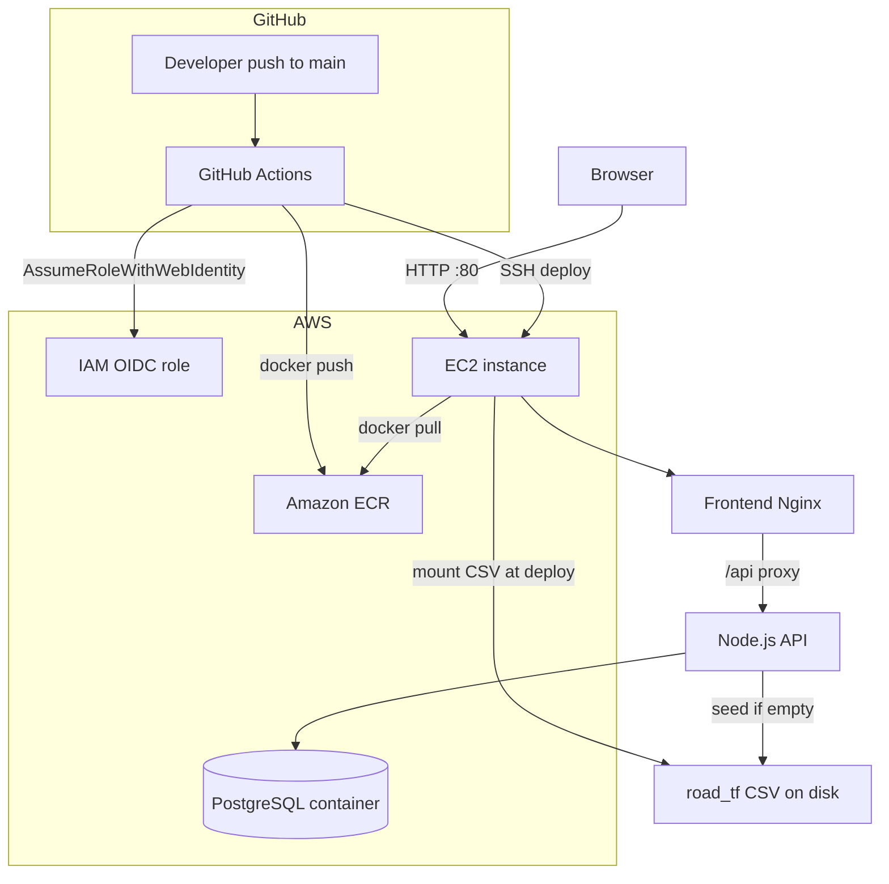
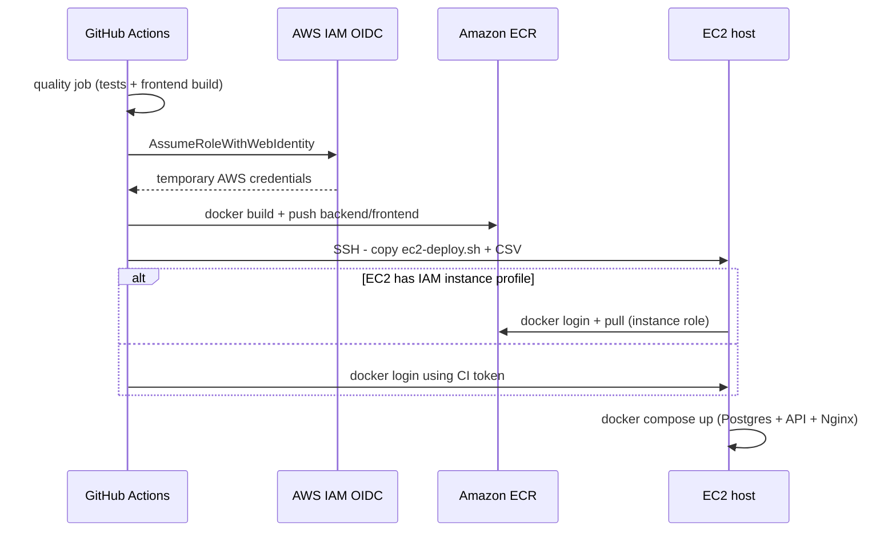

# Traffic Data Dashboard

Full-stack traffic analytics web application for the take-home assignment: interactive **country-wise** and **vehicle-type** charts, a **Node.js** API, **PostgreSQL** storage, **Docker**, **unit tests**, and **CI/CD** to **AWS** (GitHub OIDC + ECR + EC2).

## Live application

| | |
| --- | --- |
| **Production URL** | [http://18.219.123.18/](http://18.219.123.18/) |
| **Deploy trigger** | Every push to `main` runs GitHub Actions: tests → build Docker images → push to ECR → SSH deploy to EC2 |

The dashboard loads traffic data from PostgreSQL on the EC2 host. When you merge or push code to `main`, the pipeline rebuilds images and restarts containers automatically (typically within a few minutes).

---

## Assignment requirements  - how this repo answers them

| Requirement | Implementation |
| --- | --- |
| **Frontend: two interactive graphs** | **Country-wise:** `TopCountriesBar` (bar), `TotalTrafficTrend` (line). **Vehicle distribution:** `VehicleDistributionDonut` (pie/donut). Additional charts: stacked bar, cumulative area (see [frontend/README.md](frontend/README.md)). All charts use **[Recharts](https://recharts.org/)** for rendering; layout uses **Tailwind CSS**. |
| **Clean, responsive UI** | React + Vite + Tailwind CSS + shadcn/ui-style components; mobile-friendly grid and filters. |
| **Backend API** | Node.js + Express; JSON REST under `/api/traffic/*`. |
| **Database (PostgreSQL)** | Table `traffic_data`; CRUD on raw rows with automatic recalculation of chart rows. |
| **Scalability (5 → 50 → 500 RPS)** | Documented below and in backend README. |
| **Bonus: Docker** | `docker-compose.yml`, `backend/Dockerfile`, `frontend/Dockerfile`. |
| **Bonus: CI/CD** | `.github/workflows/ci.yml` + `deploy-ecr-ec2.yml`. |
| **Bonus: Unit tests** | Vitest in `backend/tests/` and `frontend/src/**/*.test.ts`. |
| **README: setup, architecture** | This file + [frontend/README.md](frontend/README.md) + [backend/README.md](backend/README.md). |

---

## System architecture



**Data path**

1. Source file `road_tf_veh_linear_2_0 2 _ cleaned.csv` lives in the **Git repository** (for local dev and CI).
2. The CSV is **not** baked into backend Docker images (`.dockerignore` excludes it).
3. On deploy, GitHub Actions **copies the CSV to the EC2 host** and mounts it into the backend container for one-time/auto seeding.
4. PostgreSQL on EC2 holds raw + calculated rows after seed.

**Optional local database:** [Supabase](https://supabase.com/) free tier PostgreSQL  - set `DATABASE_URL` in `backend/.env`; SSL is enabled automatically for `supabase.co` hosts. See [backend/README.md](backend/README.md).

---

## Project structure

```text
TrafficData/
  .github/workflows/
    ci.yml                 # Tests on push/PR
    deploy-ecr-ec2.yml     # Test, ECR push, EC2 deploy
  backend/                 # Express API (see backend/README.md)
  frontend/                # React dashboard (see frontend/README.md)
  deploy/
    ec2-deploy.sh          # On-server docker compose pull/up
  docker-compose.yml       # Local: Postgres + backend + frontend
  road_tf_veh_linear_2_0 2 _ cleaned.csv   # Dataset (in git; not in ECR image)
```

IAM policy templates for AWS setup are kept locally under `deploy/aws/` (gitignored) and are not required on GitHub.

---

## Dataset and database

### Data source

The traffic figures come from **[Eurostat  - Road traffic (vehicles)](https://ec.europa.eu/eurostat/databrowser/view/road_tf_veh/default/table?lang=en)** (`road_tf_veh`), exported and cleaned into `road_tf_veh_linear_2_0 2 _ cleaned.csv` in this repository.

**Why this dataset:** it matches the assignment’s two analytical dimensions in one table:

1. **Traffic volume**  - reported in **million vehicle-kilometres (VKM)** (`traffic_volume` in the app), suitable for country totals and time trends.
2. **Vehicle type**  - broken down by `vehicle_id` (cars, lorries, buses, motorcycles, etc.), suitable for distribution and composition charts.

That combination supports both required views (country-wise traffic and vehicle-type distribution) without merging separate datasets.

### CSV columns

| Column | Meaning | Example |
| --- | --- | --- |
| `vehicle_id` | Vehicle category code | `CAR`, `LOR`, `TOTAL` |
| `country_code` | ISO-style country code | `FR`, `DE`, `UK` |
| `year` | Reporting year | `2024` |
| `traffic_volume` | Traffic in million vehicle-kilometres (VKM) from Eurostat | `7494045.604` |

### PostgreSQL table `traffic_data`

| Column | Type | Notes |
| --- | --- | --- |
| `id` | SERIAL | Primary key |
| `country_code` | VARCHAR(16) | 32 countries in dataset |
| `vehicle_id` | VARCHAR(64) | 17 raw codes + calculated parents |
| `year` | INTEGER | 2011–2024 |
| `traffic_volume` | NUMERIC | Used in all aggregations |
| `is_calculated` | BOOLEAN | `false` = raw CSV; `true` = chart-ready row |

**Countries (32):** AT, BE, BG, CH, CY, CZ, DE, DK, EE, ES, FI, FR, GE, HR, HU, IE, IS, IT, LT, LV, MK, MT, NL, NO, PL, PT, RO, SE, SI, TR, UA, UK.

**Raw vehicle codes (17):** BIKE, BUS, BUS_MCO_MIN, BUS_MCO_TRO, BUS_TRO, CAR, LOR, LOR_GT3P5-6, LOR_GT6, LOR_LE3P5, MCO, MOP, MOTO, MOTO_MOP, RDMVEH_OTH, TOTAL, TRC.

### Calculation rules (summary)

- Raw rows: `is_calculated = false`.
- Per `(country_code, year)`, the API builds calculated rows (`is_calculated = true`): chart `TOTAL`, rolled-up parents (e.g. `LOR` includes subcategories), and `*_UNIDENTIFIED` buckets for drill-down.
- Logic: `backend/src/services/trafficNormalization.js`, import: `backend/src/database/trafficDataImport.js`.

---

## Run locally

### Prerequisites

- Node.js 22+
- Docker Desktop (optional, for full stack)
- PostgreSQL or Supabase URL (optional; or use CSV-only backend mode)

### 1. Install dependencies

```powershell
cd D:\TrafficData\backend
npm install

cd D:\TrafficData\frontend
npm install
```

### 2. Backend

```powershell
cd D:\TrafficData\backend
copy .env.example .env
# Edit DATABASE_URL for local Postgres or Supabase
```

**PostgreSQL mode (assignment-complete):**

```powershell
# From repo root  - starts Postgres + seeds from mounted CSV
docker compose up postgres -d

cd D:\TrafficData\backend
npm run dev:postgres
```

**CSV-only mode (quick UI check without DB):**

```powershell
npm run dev:csv
```

API: `http://localhost:4000`  - health: `GET /api/health`

**One-time import (Supabase or local Postgres):**

```powershell
$env:DATABASE_URL="postgres://..."
$env:CSV_PATH="D:\TrafficData\road_tf_veh_linear_2_0 2 _ cleaned.csv"
npm run import:data -- --truncate
```

### 3. Frontend

```powershell
cd D:\TrafficData\frontend
copy .env.example .env
npm run dev
```

App: `http://localhost:5173` (proxies API to port 4000 in dev via Vite config / env).

### 4. Full stack with Docker Compose

```powershell
cd D:\TrafficData
docker compose up --build
```

| Service | URL |
| --- | --- |
| Frontend | http://localhost:8080 |
| Backend | http://localhost:4000 |
| PostgreSQL | localhost:5432 |

---

## CI/CD pipeline (GitHub Actions + AWS)

Two workflows run on pushes to `main` (deploy also supports manual **workflow_dispatch**).

### Workflow 1: `ci.yml` (quality gate)

| Job | Steps |
| --- | --- |
| **backend** | `npm ci` → `npm test` |
| **frontend** | `npm ci` → `npm test` → `npm run build` |

Runs on **pull requests** and **pushes** to `main`.

### Workflow 2: `deploy-ecr-ec2.yml` (build & deploy)



| Step | What happens |
| --- | --- |
| **quality** | Same tests as CI  - deploy blocked if tests fail. |
| **Configure AWS credentials** | `aws-actions/configure-aws-credentials@v4` with `AWS_ROLE_TO_ASSUME` (no stored access keys). |
| **Login to ECR** | Push images tagged with `github.sha` and `latest`. |
| **Copy deploy assets** | `scp` `deploy/ec2-deploy.sh` and CSV to `/opt/traffic-data/` on EC2. |
| **Run deploy on EC2** | `docker compose pull && up -d` for Postgres, backend, frontend. |

### AWS services used

| Service | Purpose |
| --- | --- |
| **IAM OIDC provider** | Trust `token.actions.githubusercontent.com` for GitHub Actions. |
| **IAM role (GitHub)** | ECR push (+ pull token fallback for deploy). |
| **Amazon ECR** | Private registry for `traffic-data-backend` and `traffic-data-frontend`. |
| **Amazon EC2** | Single host running Docker Compose (Postgres + app). |
| **IAM role (EC2)** | ECR pull on the instance (recommended). |

No RDS, SSM, or Lambda in the current pipeline.

### GitHub configuration

**Variables:** `AWS_REGION`, `AWS_ROLE_TO_ASSUME`, `EC2_HOST`, `FRONTEND_ORIGIN`, optional `EC2_USER`, ECR repo names.

**Secrets:** `EC2_SSH_PRIVATE_KEY`, `POSTGRES_PASSWORD`.

Detailed AWS console steps were documented during initial setup; IAM JSON templates live in local `deploy/aws/`.

---

## Tests

```powershell
cd D:\TrafficData\backend
npm test

cd D:\TrafficData\frontend
npm test
```

| Area | Files | Focus |
| --- | --- | --- |
| Backend | `traffic.service.test.js`, `trafficNormalization.test.js` | Chart query semantics, vehicle rollups, cumulative math |
| Frontend | `chartTransforms.test.ts`, `format.test.ts`, `filterDefaults.test.ts` | Data shaping, formatting, filter defaults |

CI runs these on every push and before deploy.

---

## Scalability (5 → 50 → 500 RPS)

| Target | Design |
| --- | --- |
| **5 RPS** | One EC2 instance (current), one Postgres container, indexed `traffic_data` table. |
| **50 RPS** | Application Load Balancer in front of multiple EC2 instances or target groups; managed PostgreSQL (RDS or Supabase Pro); Redis/ElastiCache for `/api/traffic/*` aggregate caching; connection pooling (PgBouncer). |
| **500 RPS** | **ECS or Fargate** for stateless API and frontend tasks with autoscaling; read replicas for analytics queries; precomputed materialized views; API rate limiting; CloudWatch + X-Ray tracing. |

---

## Future improvements

| Area | Idea |
| --- | --- |
| **Assets / performance** | Store logo and static assets in **S3 + CloudFront** instead of bundling in the frontend image  - faster global render and smaller deploy artifacts. |
| **HTTPS / domain** | Register a domain (Route 53), issue **ACM** certificate, terminate TLS on **ALB** or CloudFront instead of plain HTTP on EC2. |
| **Load balancing** | Put an **ALB** in front of several EC2 instances (or ECS tasks) for HA and horizontal scale. |
| **Containers** | Move from single-host Compose to **ECS Fargate** or **EKS** with task autoscaling. |
| **Database** | **RDS PostgreSQL** or Supabase with read replicas; migrate off containerized Postgres on EC2. |
| **Cache** | **ElastiCache (Redis)** for filter metadata and heavy chart endpoints (TTL per country/year). |
| **Async updates** | On raw row **POST/PUT/DELETE**, publish to **SQS**; **Lambda** or worker tasks recalculate aggregates instead of blocking the request path. |
| **IaC** | **Terraform** or AWS CDK for VPC, EC2/ECS, ECR, IAM OIDC, ALB, RDS, and secrets  - reproducible environments. |
| **CI/CD** | Separate staging workflow; smoke tests against `/api/health` after deploy; blue/green on ECS. |
| **Observability** | Structured logs to CloudWatch, alarms on 5xx rate and p95 latency. |
| **Security** | Restrict SSH to GitHub IP ranges; AWS Secrets Manager for `POSTGRES_PASSWORD`; IMDSv2 on EC2. |
| **Code quality** | Resolve all **ESLint** warnings/errors across frontend and backend (`eslint.config.js`), and add a lint job to GitHub Actions so CI fails on new issues. |

---

## API reference (short)

- `GET /api/health`
- `GET /api/traffic/filters`  - metadata for UI filters
- `GET /api/traffic/trend`  - country line chart
- `GET /api/traffic/top-countries`  - country bar chart
- `GET /api/traffic/distribution`  - vehicle donut
- `GET /api/traffic/stacked`, `/cumulative`, `/compare`, …
- `POST|PUT|DELETE /api/traffic`  - mutate raw rows (PostgreSQL recalculates)

Full list: [backend/README.md](backend/README.md).

---

## Useful SQL

```sql
SELECT is_calculated, COUNT(*) FROM traffic_data GROUP BY is_calculated;

SELECT country_code, year, vehicle_id, traffic_volume
FROM traffic_data
WHERE is_calculated = TRUE
ORDER BY country_code, year, vehicle_id
LIMIT 20;
```

---

## Repository links

- **Frontend details (charts, Tailwind, shadcn, folder layout):** [frontend/README.md](frontend/README.md)
- **Backend details (API layers, DB, Supabase, tests):** [backend/README.md](backend/README.md)
- **GitHub:** https://github.com/ajayr6696/TrafficData
